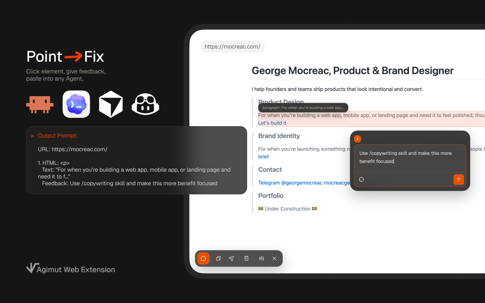

# Agimut



Annotate live pages. Copy the output. Paste it into Claude Code, Codex, or whatever agent you use.

Agimut is a Chrome extension for design review. It lets you pin comments on UI elements or text selections and export them as structured text with selectors, rendered HTML, quotes, and page context.

## Install

**Chrome Web Store:** [Agimut](https://chromewebstore.google.com/detail/kjkhilpfobeadgnhnoomknmblnccakmf)

**Manual install:**

1. Clone this repo
2. Open `chrome://extensions`
3. Enable **Developer mode**
4. Click **Load unpacked** and select the repo directory
5. Optional: enable **Allow access to file URLs** if you want to annotate local HTML files


## Why

Instead of describing UI issues in words and hoping the agent finds the right element, you annotate it directly and the export bridges the gap between what you see in the browser and what the agent sees in your code.

Agimut is designed for AI-assisted workflows. Tools like Claude Code, Cursor, and Codex can read the structured output and immediately understand what you're pointing at. Each annotation gives them:

- **CSS selectors** that map directly to elements in your source code
- **Rendered HTML with stable attributes** that work across any framework
- **Text previews or exact quotes** depending on whether you annotate an element or a text selection
- **Ancestor context** showing where the target sits in the page structure
- **Your comments** explaining what needs to change and why

## Popup controls

The popup lets you:

- enable or disable Agimut for the current site
- limit the extension to dev environments (`localhost`, `127.0.0.1`, `.local`)
- switch between dark and light theme
- choose the toolbar corner

## Export format

```
URL: https://example.com/page

1.
   HTML: <li class="flex items-center gap-6 px-4 py-2 text-sm">
   Text: "Products"
   Context: nav
   Feedback: Spacing between nav items is inconsistent, should be 16px

2.
   Quote: "Start free for 14 days"
   Context: main > section
   Feedback: This line should be more prominent
```

If a saved target no longer exists, Agimut keeps the comment as an orphan and exports it with `Status: Element not found`.

## How it works

1. Open the popup and enable Agimut for the current site
2. Click the floating Agimut button to open the toolbar
3. Hover elements or select text to target what you want to annotate
4. Add comments
5. Hit **A** to copy everything
6. Paste into your agent, ticket, or chat

Annotations persist per page and restore on reload. Hash-only changes keep the current page's annotations in place. Route changes swap to the annotation set for that page.

## Keyboard shortcuts

| Key | Action |
|---|---|
| **C** | Toggle comment mode |
| **A** | Copy all annotations |
| **Shift+A** | Copy all & clear |
| **XXX** | Delete all annotations |
| **Z** | Undo delete (5s window) |
| **Esc** | Close / exit comment mode |

### Keyboard navigation

Keyboard navigation is enabled by default. Toggle it in the in-page menu (click the sliders icon on the toolbar). When active in comment mode:

| Key | Action |
|---|---|
| **Arrow keys** | Move selection spatially (up/down/left/right) |
| **Shift+Up/Down** | Select parent or child element |
| **Tab / Shift+Tab** | Cycle through elements in DOM order |
| **Enter** | Annotate the selected element |

This lets you select a card container vs. the text inside it, which matters for precise design review.

## Current version (v1.4)

- text selection annotations
- per-page persistence with route-aware restore
- orphan handling when saved targets disappear
- floating annotation navigator
- orange comment badges with white text
- site-level popup controls for enable/disable, dev-only mode, theme, and toolbar position

## License

MIT
